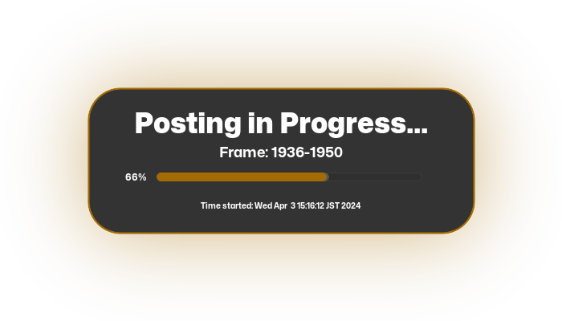

<h1 align="center">Every Azumanga Daioh Frame in Order BOT</h1>

<div align="center">

`An OpenSource BOT for Facebook Frame in Order`<br>

</div>


## Tutorial
[This](https://github.com/fearocanity/ebtrfio-template) section tells how to make it work. In more detailed way.


```
If you have ideas or fixes to the bugs and also improving the codes, Feel free to [Contribute](./CONTRIBUTING.md)! 😉
</div>

## Status

